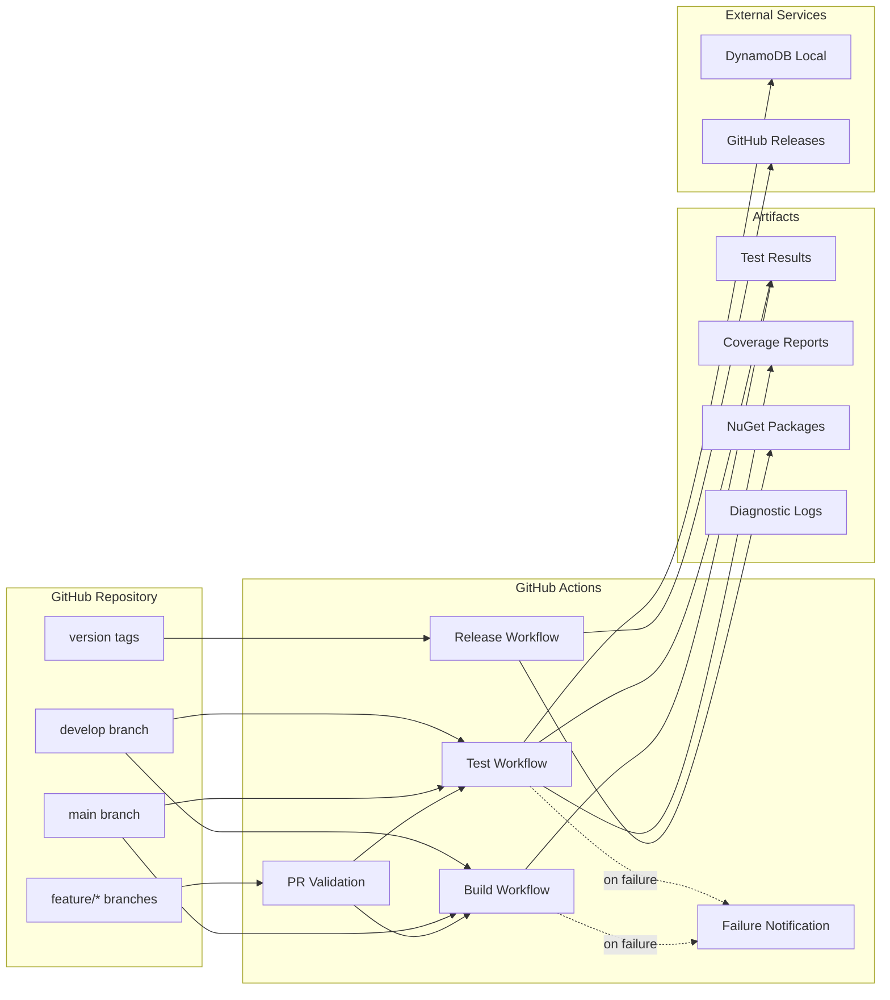

# Design Document

## Overview

This design establishes a comprehensive CI/CD pipeline for the Oproto.FluentDynamoDb open source project using GitHub Actions. The pipeline automates testing, versioning, changelog management, and NuGet package preparation while ensuring code quality through branch protection and PR validation.

The design follows industry best practices for .NET open source projects, including semantic versioning, Keep a Changelog format, and automated release workflows triggered by git tags.

## Architecture

### Workflow Architecture

The CI/CD system consists of five primary workflows:

1. **Build Validation Workflow** (`build.yml`) - Validates compilation across platforms
2. **Test Workflow** (`test.yml`) - Executes unit and integration tests with coverage
3. **Release Workflow** (`release.yml`) - Builds and prepares NuGet packages from version tags
4. **PR Validation Workflow** (`pr-validation.yml`) - Comprehensive PR checks
5. **Failure Notification Workflow** (`failure-notification.yml`) - Creates issues for workflow failures

```mermaid
graph TB
    subgraph "Pull Request Flow"
        PR[Pull Request] --> PRVal[PR Validation]
        PRVal --> Build[Build Check]
        PRVal --> Test[Test Check]
        PRVal --> Changelog[Changelog Check]
        Build --> Merge{All Checks Pass?}
        Test --> Merge
        Changelog --> Merge
        Merge -->|Yes| Approved[Ready to Merge]
        Merge -->|No| Blocked[Blocked]
    end
    
    subgraph "Release Flow"
        Tag[Version Tag Push] --> Release[Release Workflow]
        Release --> BuildPkg[Build Packages]
        BuildPkg --> Validate[Validate Packages]
        Validate --> Upload[Upload Artifacts]
        Upload --> GHRelease[Create GitHub Release]
    end
    
    subgraph "Continuous Integration"
        Push[Push to main/develop] --> CIBuild[Build Workflow]
        CIBuild --> CITest[Test Workflow]
        CITest -->|Failure| Notify[Failure Notification]
    end
```




### Component Diagram



## Components and Interfaces

### 1. Build Validation Workflow

**Purpose**: Validate that the solution builds successfully across all target platforms.

**Triggers**:
- Push to `main` or `develop` branches
- Pull requests targeting `main` or `develop`
- Manual dispatch

**Jobs**:
- `build`: Matrix job running on ubuntu-latest, windows-latest, macos-latest

**Steps**:
1. Checkout code
2. Setup .NET 8.0 SDK
3. Restore NuGet dependencies with caching
4. Build solution in Release configuration
5. Upload build artifacts for test jobs

**Outputs**:
- Build artifacts (binaries) cached for 1 day
- Build status (success/failure)

**Key Configuration**:
```yaml
strategy:
  fail-fast: false
  matrix:
    os: [ubuntu-latest, windows-latest, macos-latest]
```


### 2. Test Workflow

**Purpose**: Execute unit and integration tests with code coverage collection.

**Triggers**:
- Push to `main` or `develop` branches
- Pull requests targeting `main` or `develop`
- Manual dispatch
- Called by PR validation workflow

**Jobs**:
- `unit-tests`: Matrix job for unit tests across platforms
- `integration-tests`: Matrix job for integration tests with DynamoDB Local
- `test-summary`: Aggregates and reports test results

**Unit Tests Steps**:
1. Checkout code
2. Setup .NET 8.0 SDK
3. Download build artifacts (or build if not available)
4. Run unit tests with coverage: `dotnet test --filter "Category=Unit"`
5. Generate coverage reports using ReportGenerator
6. Upload test results and coverage reports

**Integration Tests Steps**:
1. Checkout code
2. Setup .NET 8.0 SDK
3. Setup Java 17 (for DynamoDB Local)
4. Download and extract DynamoDB Local
5. Download build artifacts (or build if not available)
6. Run integration tests: `dotnet test Oproto.FluentDynamoDb.IntegrationTests`
7. Collect DynamoDB Local logs on failure
8. Upload test results and diagnostic logs

**Test Summary Steps**:
1. Download all test result artifacts
2. Download coverage reports
3. Parse TRX files and coverage data
4. Generate markdown summary with:
   - Total tests executed
   - Pass/fail counts and percentages
   - Platform coverage matrix
   - Code coverage metrics
   - Performance metrics (execution time)
5. Post summary to GitHub Actions summary page

**Key Configuration**:
```yaml
env:
  DYNAMODB_LOCAL_PATH: ${{ github.workspace }}/dynamodb-local
  DOTNET_CLI_TELEMETRY_OPTOUT: 1
  DOTNET_SKIP_FIRST_TIME_EXPERIENCE: 1
```

**Integration Test Fix**:
The current issue is that `--no-build` flag is used without ensuring the test project is built. The fix:
1. Remove `--no-build` flag from integration test command
2. OR ensure build artifacts are properly restored before running tests
3. Add explicit build step: `dotnet build Oproto.FluentDynamoDb.IntegrationTests --configuration Release`


### 3. Release Workflow

**Purpose**: Build NuGet packages and create GitHub releases from version tags.

**Triggers**:
- Push of tags matching `v*.*.*` (e.g., v1.0.0, v1.2.3-beta.1)

**Jobs**:
- `validate-tag`: Validates tag format and changelog entry
- `build-packages`: Builds all NuGet packages
- `create-release`: Creates GitHub release with packages

**Validate Tag Steps**:
1. Checkout code
2. Extract version from tag (remove 'v' prefix)
3. Validate semantic version format
4. Check if CHANGELOG.md contains section for this version
5. Extract release notes from changelog
6. Output version and release notes for subsequent jobs

**Build Packages Steps**:
1. Checkout code
2. Setup .NET 8.0 SDK
3. Restore dependencies
4. Build all packable projects with version from tag:
   - Oproto.FluentDynamoDb
   - Oproto.FluentDynamoDb.Attributes
   - Oproto.FluentDynamoDb.BlobStorage.S3
   - Oproto.FluentDynamoDb.Encryption.Kms
   - Oproto.FluentDynamoDb.FluentResults
   - Oproto.FluentDynamoDb.Logging.Extensions
   - Oproto.FluentDynamoDb.NewtonsoftJson
   - Oproto.FluentDynamoDb.SystemTextJson
5. Pack projects: `dotnet pack -p:Version=$VERSION -p:PackageVersion=$VERSION`
6. Validate package contents
7. Generate package manifest (JSON file listing all packages)
8. Upload packages as artifacts (90-day retention)

**Create Release Steps**:
1. Download package artifacts
2. Create GitHub Release:
   - Tag: from trigger
   - Name: "Release v{version}"
   - Body: extracted from CHANGELOG.md
   - Pre-release: true if version contains hyphen
3. Upload all .nupkg and .snupkg files to release
4. Upload package manifest

**Package List**:
All projects with `IsPackable=true` and `GeneratePackageOnBuild=true`:
1. Oproto.FluentDynamoDb (main library with embedded source generator)
2. Oproto.FluentDynamoDb.BlobStorage.S3 (S3 blob storage)
3. Oproto.FluentDynamoDb.Encryption.Kms (KMS encryption)
4. Oproto.FluentDynamoDb.FluentResults (FluentResults integration)
5. Oproto.FluentDynamoDb.Logging.Extensions (Microsoft.Extensions.Logging)
6. Oproto.FluentDynamoDb.NewtonsoftJson (Newtonsoft.Json serialization)
7. Oproto.FluentDynamoDb.SystemTextJson (System.Text.Json serialization)

**Note**: Oproto.FluentDynamoDb.Attributes was removed as it's now embedded in the main library. The source generator is also embedded in the main package.

**Version Override**:
```bash
dotnet pack \
  --configuration Release \
  --no-build \
  -p:Version=$VERSION \
  -p:PackageVersion=$VERSION \
  -p:AssemblyVersion=$VERSION \
  -p:FileVersion=$VERSION \
  -p:InformationalVersion=$VERSION
```


### 4. PR Validation Workflow

**Purpose**: Comprehensive validation of pull requests before merge.

**Triggers**:
- Pull request opened, synchronized, or reopened
- Targets `main` or `develop` branches

**Jobs**:
- `validate-pr`: Validates PR metadata and changelog
- `build`: Calls build workflow
- `test`: Calls test workflow
- `summary`: Aggregates all validation results

**Validate PR Steps**:
1. Checkout code with full history
2. Check if CHANGELOG.md was modified
3. Validate changelog format (Keep a Changelog)
4. Check for "Unreleased" section updates
5. Validate PR title format (optional: conventional commits)
6. Check for linked issues
7. Report validation results

**Summary Steps**:
1. Wait for all validation jobs
2. Aggregate results
3. Post comment on PR with:
   - Build status per platform
   - Test results summary
   - Coverage changes
   - Changelog validation status
4. Set final status check

**Changelog Validation**:
- Ensure CHANGELOG.md exists
- Verify "Unreleased" section exists
- Check that changes are categorized (Added, Changed, Fixed, etc.)
- Warn if no changelog entry (allow override with label)


### 5. Failure Notification Workflow

**Purpose**: Create GitHub issues for workflow failures on main/develop branches.

**Triggers**:
- Workflow run completed (on: workflow_run)
- Only for main and develop branches
- Only on failure status

**Steps**:
1. Get workflow run details
2. Check if issue already exists for this workflow
3. If exists: Update issue with new failure information
4. If not exists: Create new issue with:
   - Title: "CI Failure: {workflow_name} on {branch}"
   - Labels: ci-failure, bug
   - Body: Workflow details, failure reason, link to run
5. If workflow succeeds after failure: Close the issue

**Issue Template**:
```markdown
## CI Failure Report

**Workflow**: {workflow_name}
**Branch**: {branch}
**Commit**: {sha}
**Run**: {run_url}

### Failure Details
{failure_details}

### Action Required
Please investigate and fix the failing workflow.

---
*This issue was automatically created by the CI/CD system.*
```

## Data Models

### Version Tag Format

**Pattern**: `v{MAJOR}.{MINOR}.{PATCH}[-{PRERELEASE}]`

**Examples**:
- `v1.0.0` - Stable release
- `v1.2.3` - Stable release
- `v2.0.0-alpha.1` - Alpha pre-release
- `v2.0.0-beta.2` - Beta pre-release
- `v2.0.0-rc.1` - Release candidate

**Validation Regex**:
```regex
^v(0|[1-9]\d*)\.(0|[1-9]\d*)\.(0|[1-9]\d*)(?:-((?:0|[1-9]\d*|\d*[a-zA-Z-][0-9a-zA-Z-]*)(?:\.(?:0|[1-9]\d*|\d*[a-zA-Z-][0-9a-zA-Z-]*))*))?$
```


### Changelog Format

**Standard**: Keep a Changelog 1.1.0

**Structure**:
```markdown
# Changelog

All notable changes to this project will be documented in this file.

The format is based on [Keep a Changelog](https://keepachangelog.com/en/1.1.0/),
and this project adheres to [Semantic Versioning](https://semver.org/spec/v2.0.0.html).

## [Unreleased]

### Added
- New features

### Changed
- Changes in existing functionality

### Deprecated
- Soon-to-be removed features

### Removed
- Removed features

### Fixed
- Bug fixes

### Security
- Security fixes

## [1.0.0] - 2025-11-01

### Added
- Initial release
```

**Categories**:
- **Added**: New features
- **Changed**: Changes in existing functionality
- **Deprecated**: Soon-to-be removed features
- **Removed**: Removed features
- **Fixed**: Bug fixes
- **Security**: Security vulnerability fixes

**Version Section Format**:
```markdown
## [{version}] - {YYYY-MM-DD}
```

### Package Manifest Format

**File**: `package-manifest.json`

**Schema**:
```json
{
  "version": "1.0.0",
  "tag": "v1.0.0",
  "commit": "abc123...",
  "buildDate": "2025-11-01T12:00:00Z",
  "packages": [
    {
      "id": "Oproto.FluentDynamoDb",
      "version": "1.0.0",
      "file": "Oproto.FluentDynamoDb.1.0.0.nupkg",
      "symbolsFile": "Oproto.FluentDynamoDb.1.0.0.snupkg",
      "size": 123456,
      "sha256": "abc123..."
    }
  ]
}
```


### Test Results Summary Format

**Display in GitHub Actions Summary**:

```markdown
# 📊 Test Results Summary

## Test Execution Status
- Unit Test Results: 3 platform(s)
- Integration Test Results: 3 platform(s)

## Platform Coverage
Tests executed on:
- ✅ ubuntu-latest
- ✅ windows-latest
- ✅ macos-latest

## 📈 Test Metrics
| Metric | Value |
|--------|-------|
| Total Tests | 1,234 |
| ✅ Passed | 1,230 (99.7%) |
| ❌ Failed | 4 |
| ⏱️ Total Duration | 8m 32s |

✅ **Performance Target Met** (≤ 10m)

## 📊 Code Coverage
| Metric | Coverage |
|--------|----------|
| Line Coverage | 85.3% |
| Branch Coverage | 78.9% |

✅ **Coverage meets threshold** (≥ 70%)
```

## Error Handling

### Build Failures

**Detection**: Exit code from `dotnet build` command

**Handling**:
1. Capture build output
2. Parse error messages
3. Display in workflow log
4. Set job status to failed
5. Trigger failure notification (if on main/develop)

**User Feedback**:
- Clear error message in workflow summary
- Link to build logs
- Suggestion to run `dotnet build` locally

### Test Failures

**Detection**: Exit code from `dotnet test` command

**Handling**:
1. Continue test execution on other platforms (fail-fast: false)
2. Collect test results (TRX files)
3. Parse failure details
4. Upload diagnostic artifacts
5. Display failure summary

**User Feedback**:
- Test failure count and names
- Platform-specific failures
- Link to detailed TRX files
- DynamoDB Local logs (for integration tests)


### Tag Validation Failures

**Detection**: Invalid tag format or missing changelog entry

**Handling**:
1. Validate tag format against regex
2. Check CHANGELOG.md for version section
3. If invalid: Fail workflow with clear message
4. If valid: Extract version and release notes

**User Feedback**:
```
❌ Invalid version tag format: v1.0
Expected format: v{MAJOR}.{MINOR}.{PATCH}[-{PRERELEASE}]
Examples: v1.0.0, v2.1.3-beta.1
```

```
❌ Changelog entry not found for version 1.0.0
Please add a section in CHANGELOG.md:
## [1.0.0] - YYYY-MM-DD
```

### Package Build Failures

**Detection**: Exit code from `dotnet pack` command

**Handling**:
1. Identify which project failed
2. Capture pack output
3. Validate package metadata
4. Fail workflow if any package fails

**User Feedback**:
- Project name that failed
- Pack error message
- Suggestion to run `dotnet pack` locally

### DynamoDB Local Failures

**Detection**: 
- Download failure (HTTP error)
- Startup timeout (30 seconds)
- Connection failure

**Handling**:
1. Retry download once
2. Check Java installation
3. Verify port 8000 availability
4. Collect startup logs
5. Skip integration tests if cannot start

**User Feedback**:
- Clear error message about DynamoDB Local
- Java version information
- Port availability check results
- Link to DynamoDB Local documentation


## Testing Strategy

### Unit Tests

**Scope**: All unit test projects (*UnitTests.csproj)

**Execution**:
- Filter: `--filter "Category=Unit"`
- Platforms: Linux, Windows, macOS
- Parallel: Yes (across platforms)
- Coverage: Yes (Coverlet)

**Success Criteria**:
- All tests pass
- No build errors
- Coverage ≥ 70%

### Integration Tests

**Scope**: Oproto.FluentDynamoDb.IntegrationTests

**Execution**:
- Explicit project reference
- Platforms: Linux, Windows, macOS
- Parallel: Yes (across platforms)
- Coverage: Yes (Coverlet)
- Dependencies: DynamoDB Local, Java 17

**Success Criteria**:
- All tests pass
- DynamoDB Local starts successfully
- No connection errors

### Workflow Tests

**Scope**: GitHub Actions workflows themselves

**Validation**:
- Syntax validation (yamllint)
- Action version checks
- Required secrets validation

**Manual Testing**:
- Test on feature branch before merge
- Verify all matrix combinations
- Check artifact uploads

## Branching Strategy

### Branch Structure

```
main (protected)
├── develop (protected)
│   ├── feature/add-new-operation
│   ├── feature/improve-logging
│   └── bugfix/fix-query-builder
└── release/v1.0.0 (temporary)
```

### Branch Purposes

**main**:
- Production-ready code
- Only accepts merges from develop or hotfix branches
- Protected: requires PR, reviews, passing checks
- Tagged for releases

**develop**:
- Integration branch for features
- Accepts merges from feature branches
- Protected: requires PR, reviews, passing checks
- Pre-release tags can be created here

**feature/***:
- New features or enhancements
- Branched from develop
- Merged back to develop via PR
- Deleted after merge

**bugfix/***:
- Bug fixes for develop
- Branched from develop
- Merged back to develop via PR
- Deleted after merge

**hotfix/***:
- Critical fixes for production
- Branched from main
- Merged to both main and develop
- Deleted after merge


### Release Process

**Stable Release** (from main):
1. Ensure develop is merged to main
2. Update CHANGELOG.md (move Unreleased to version section)
3. Commit changelog update
4. Create and push tag: `git tag v1.0.0 && git push origin v1.0.0`
5. Release workflow builds packages
6. GitHub Release created automatically
7. Manually publish packages to NuGet.org (future: automate)

**Pre-release** (from develop):
1. Update CHANGELOG.md with pre-release notes
2. Commit changelog update
3. Create and push tag: `git tag v1.0.0-beta.1 && git push origin v1.0.0-beta.1`
4. Release workflow builds packages with pre-release flag
5. GitHub Release created as pre-release
6. Manually publish to NuGet.org with pre-release flag

**Hotfix Release**:
1. Create hotfix branch from main
2. Fix the issue
3. Update CHANGELOG.md
4. Merge to main via PR
5. Merge to develop
6. Tag main with patch version: `v1.0.1`
7. Release workflow runs

### Version Numbering

**Semantic Versioning**: MAJOR.MINOR.PATCH[-PRERELEASE]

**MAJOR**: Incremented for breaking changes
- API changes that break backward compatibility
- Removal of deprecated features
- Major architectural changes

**MINOR**: Incremented for new features
- New functionality added
- Backward-compatible API additions
- Significant enhancements

**PATCH**: Incremented for bug fixes
- Bug fixes
- Performance improvements
- Documentation updates

**PRERELEASE**: Optional suffix for pre-releases
- `alpha.N`: Early testing, unstable
- `beta.N`: Feature complete, testing
- `rc.N`: Release candidate, final testing

**Examples**:
- `1.0.0` → `1.0.1` (bug fix)
- `1.0.1` → `1.1.0` (new feature)
- `1.1.0` → `2.0.0` (breaking change)
- `2.0.0` → `2.0.0-alpha.1` (pre-release)
- `2.0.0-alpha.1` → `2.0.0-beta.1` (pre-release progression)
- `2.0.0-rc.1` → `2.0.0` (stable release)


## Branch Protection Rules

### Main Branch Protection

**Settings**:
- Require pull request before merging: ✅
- Require approvals: 1
- Dismiss stale approvals: ✅
- Require review from code owners: ❌ (optional)
- Require status checks to pass: ✅
  - build (ubuntu-latest)
  - build (windows-latest)
  - build (macos-latest)
  - unit-tests (ubuntu-latest)
  - unit-tests (windows-latest)
  - unit-tests (macos-latest)
  - integration-tests (ubuntu-latest)
  - integration-tests (windows-latest)
  - integration-tests (macos-latest)
- Require branches to be up to date: ✅
- Require conversation resolution: ✅
- Require signed commits: ❌ (optional)
- Include administrators: ✅
- Allow force pushes: ❌
- Allow deletions: ❌

### Develop Branch Protection

**Settings**: Same as main branch

**Rationale**: Develop is the integration branch and should maintain the same quality standards as main.

## Performance Considerations

### Build Caching

**Strategy**: Cache NuGet packages and build outputs

**Implementation**:
```yaml
- uses: actions/cache@v4
  with:
    path: |
      ~/.nuget/packages
      **/obj
    key: ${{ runner.os }}-nuget-${{ hashFiles('**/*.csproj') }}
    restore-keys: |
      ${{ runner.os }}-nuget-
```

**Benefits**:
- Faster dependency restoration
- Reduced network usage
- Faster builds (incremental compilation)

**Cache Invalidation**: Automatic when .csproj files change


### Parallel Execution

**Strategy**: Run independent jobs in parallel

**Matrix Jobs**:
- Build: 3 platforms in parallel
- Unit Tests: 3 platforms in parallel
- Integration Tests: 3 platforms in parallel

**Job Dependencies**:
```yaml
jobs:
  build:
    # Runs first
  
  unit-tests:
    needs: build  # Waits for build
    # 3 platforms in parallel
  
  integration-tests:
    needs: build  # Waits for build
    # 3 platforms in parallel
  
  test-summary:
    needs: [unit-tests, integration-tests]  # Waits for all tests
```

**Expected Timeline**:
- Build: 2-3 minutes per platform (parallel)
- Unit Tests: 1-2 minutes per platform (parallel)
- Integration Tests: 3-5 minutes per platform (parallel)
- Total: ~8-10 minutes

### Artifact Management

**Strategy**: Upload only necessary artifacts with appropriate retention

**Artifacts**:
- Test Results (TRX): 30 days
- Coverage Reports: 30 days
- NuGet Packages: 90 days
- Diagnostic Logs: 7 days
- Build Outputs: 1 day (for test jobs)

**Size Optimization**:
- Compress large artifacts
- Exclude unnecessary files
- Use separate artifacts per platform

## Security Considerations

### Secrets Management

**Required Secrets**: None initially (NuGet publishing will be manual)

**Future Secrets** (when automating NuGet publishing):
- `NUGET_API_KEY`: API key for NuGet.org
- Stored in GitHub repository secrets
- Scoped to release workflow only

**Best Practices**:
- Never log secrets
- Use GitHub's secret masking
- Rotate keys regularly
- Use minimal permissions


### Dependency Security

**Strategy**: Automated dependency updates and vulnerability scanning

**Tools**:
- Dependabot: Automated dependency updates
- GitHub Security Advisories: Vulnerability alerts

**Dependabot Configuration** (.github/dependabot.yml):
```yaml
version: 2
updates:
  - package-ecosystem: "nuget"
    directory: "/"
    schedule:
      interval: "weekly"
    open-pull-requests-limit: 10
    
  - package-ecosystem: "github-actions"
    directory: "/"
    schedule:
      interval: "weekly"
    open-pull-requests-limit: 5
```

### Code Signing

**Current**: No code signing (open source)

**Future Consideration**: Sign assemblies and NuGet packages
- Use Azure Key Vault for certificate storage
- Sign during release workflow
- Provides authenticity verification

## Monitoring and Observability

### Workflow Status Badges

**Location**: README.md

**Badges**:
```markdown
[](https://github.com/oproto/fluent-dynamodb/actions/workflows/build.yml)
[](https://github.com/oproto/fluent-dynamodb/actions/workflows/test.yml)
[](https://www.nuget.org/packages/Oproto.FluentDynamoDb/)
```

### Metrics Collection

**Collected Metrics**:
- Build duration per platform
- Test execution time
- Test pass/fail rates
- Code coverage percentage
- Package size

**Storage**: GitHub Actions artifacts and summaries

**Analysis**: Manual review of trends


## Documentation Structure

### CONTRIBUTING.md

**Purpose**: Guide contributors on how to contribute

**Sections**:
1. Getting Started
   - Prerequisites
   - Setting up development environment
   - Building the project
   - Running tests
2. Development Workflow
   - Branching strategy
   - Commit message guidelines
   - Pull request process
3. Coding Standards
   - C# coding conventions
   - Code formatting
   - Documentation requirements
4. Testing Guidelines
   - Writing unit tests
   - Writing integration tests
   - Test naming conventions
5. Release Process
   - Version numbering
   - Changelog updates
   - Creating releases

### CHANGELOG.md

**Purpose**: Track all notable changes

**Format**: Keep a Changelog 1.1.0

**Maintenance**:
- Contributors update Unreleased section in PRs
- Maintainers move to version section on release
- Include migration guides for breaking changes

### Release Documentation

**Location**: GitHub Releases

**Content**:
- Version number
- Release date
- Changes from CHANGELOG.md
- Breaking changes highlighted
- Migration guide (if needed)
- Download links for packages

## Migration Path

### Phase 1: Foundation (Week 1)
1. Create CHANGELOG.md with current version
2. Fix integration test workflow
3. Add build workflow
4. Set up branch protection

### Phase 2: Testing (Week 2)
1. Enhance test workflow with coverage
2. Add test summary generation
3. Implement failure notifications
4. Add status badges to README

### Phase 3: Release Automation (Week 3)
1. Create release workflow
2. Implement tag validation
3. Set up package building
4. Test with pre-release tags

### Phase 4: Documentation (Week 4)
1. Write CONTRIBUTING.md
2. Document branching strategy
3. Create release process guide
4. Add workflow documentation

### Phase 5: Refinement (Ongoing)
1. Monitor workflow performance
2. Optimize caching
3. Improve error messages
4. Add additional checks as needed


## Design Decisions and Rationale

### Decision 1: Separate Build and Test Workflows

**Rationale**: 
- Faster feedback for build failures
- Allows running tests on pre-built artifacts
- Easier to rerun just tests without rebuilding
- Better separation of concerns

**Alternative Considered**: Single workflow with build and test jobs
**Rejected Because**: Longer feedback loop, harder to debug specific failures

### Decision 2: Matrix Strategy for Platform Testing

**Rationale**:
- Ensures cross-platform compatibility
- Catches platform-specific issues early
- Parallel execution for speed
- Industry standard for .NET libraries

**Alternative Considered**: Test only on Linux
**Rejected Because**: Windows and macOS users need confidence in compatibility

### Decision 3: Keep a Changelog Format

**Rationale**:
- Industry standard
- Human-readable
- Easy to maintain
- Supports automation
- Clear categorization

**Alternative Considered**: Auto-generate from commits
**Rejected Because**: Commits are too granular, need human curation

### Decision 4: Tag-Based Releases

**Rationale**:
- Simple and intuitive
- Git-native approach
- Clear version history
- Easy to automate
- Supports pre-releases

**Alternative Considered**: Manual workflow dispatch with version input
**Rejected Because**: More error-prone, less traceable

### Decision 5: Manual NuGet Publishing (Initially)

**Rationale**:
- Allows review before public release
- Prevents accidental publishes
- Easier to test release process
- Can automate later when confident

**Alternative Considered**: Automatic publishing on tag
**Rejected Because**: Too risky for initial setup, hard to undo

### Decision 6: Fail-Fast Disabled for Tests

**Rationale**:
- See all platform failures at once
- Better understanding of cross-platform issues
- Doesn't save much time (tests run in parallel)

**Alternative Considered**: Fail-fast enabled
**Rejected Because**: Incomplete information on failures

### Decision 7: 70% Coverage Threshold

**Rationale**:
- Reasonable target for library code
- Not too strict to block progress
- Encourages good testing practices
- Can be increased over time

**Alternative Considered**: 80% or 90% threshold
**Rejected Because**: May be too strict initially, can increase later


## Repository Cleanup

### Files and Directories to Remove

The following debug/test projects and temporary files should be removed before establishing the CI/CD pipeline:

**Debug Projects** (not needed for production):
- `DebugIntegration/` - Debug project for testing integration scenarios
- `DebugSourceGenerator/` - Debug project for testing source generator
- `test-generator/` - Test project for generator validation
- `TestMultiItemGeneration/` - Test project for multi-item generation
- `TestMultiTargeting/` - Test project for multi-targeting scenarios

**Temporary Files**:
- `debug_integration_test.cs` - Standalone debug script
- `DOCUMENTATION_UPDATE_SUMMARY.md` - Temporary documentation summary
- `TestResults/` - Local test results (should be in .gitignore)

**Rationale**:
- These are development/debugging artifacts
- Not needed for library consumers
- Clutter the repository
- May confuse contributors
- Should not be packaged or published

**Action**:
1. Delete directories and files listed above
2. Update `.gitignore` to exclude TestResults/
3. Verify solution still builds after cleanup
4. Commit cleanup before implementing CI/CD

### .gitignore Updates

Ensure the following patterns are in `.gitignore`:
```
# Test Results
TestResults/
*.trx
*.coverage
*.coveragexml

# Build outputs
bin/
obj/
*.nupkg
*.snupkg

# IDE
.vs/
.vscode/
.idea/
*.user
*.suo

# OS
.DS_Store
Thumbs.db
```

